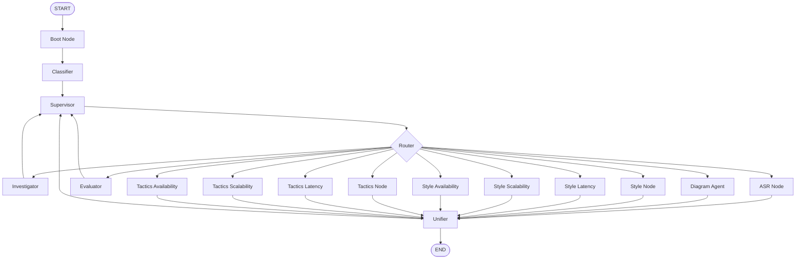

# ArchIA - Documentación Técnica del Sistema (v3)

> **Versión**: 3.0
> **Fecha**: Marzo 2025
> **Tipo de documento**: Especificación Técnica de Arquitectura Completa

---

## 1. Introducción

### 1.1 Propósito de ArchIA

**ArchIA** es un asistente inteligente especializado en el diseño de arquitectura de software, basado en la metodología **ADD 3.0** (Attribute-Driven Design). Su propósito principal es asistir a arquitectos y equipos de desarrollo durante las fases tempranas del SDLC:

| Fase del SDLC              | Contribución de ArchIA                                                              |
| -------------------------- | ----------------------------------------------------------------------------------- |
| **Análisis de Requisitos** | Extracción de ASRs (Quality Attribute Scenarios) en formato canónico de 6 partes   |
| **Diseño Arquitectónico**  | Recomendación de estilos arquitectónicos y tácticas con soporte RAG                 |
| **Documentación**          | Generación de diagramas DOT con 3 niveles de detalle y exportación multi-formato    |
| **Validación**             | Evaluación de ASRs, comparación de diagramas y consulta RAG en documentación PDF    |

### 1.2 Paradigma de Interacción

ArchIA opera mediante un **Grafo de Estados (State Graph)** orquestado por **LangGraph**. Cada mensaje del usuario inicia un flujo donde un Clasificador detecta idioma e intención, un Supervisor planifica la ejecución, y nodos especializados procesan la tarea antes de consolidar una respuesta final.

```
START → boot → classifier → supervisor → [router → nodo(s) especializado(s)] → unifier → END
```

### 1.3 Stack Tecnológico

| Componente         | Tecnología                                        |
| ------------------ | ------------------------------------------------- |
| **Backend**        | FastAPI 0.128+ / Uvicorn                          |
| **Orquestación**   | LangGraph 1.0+ con SQLite Checkpointer            |
| **LLM**            | Multi-proveedor: Azure OpenAI / OpenAI / Ollama   |
| **RAG**            | ChromaDB 1.4+ con OpenAI Embeddings               |
| **Diagramas**      | Graphviz (DOT) → SVG / draw.io XML                |
| **Persistencia**   | SQLite (estado de sesión + feedback)               |
| **PDF Extraction** | PyMuPDF (fitz) + pypdf (fallback)                  |
| **Vision**         | Vertex AI Gemini (opcional, para análisis de imágenes) |

---

## 2. Arquitectura del Flujo (El Grafo de Estados)

### 2.1 Ciclo de Procesamiento

```
┌──────────────────────────────────────────────────────────────────────────────┐
│                        CICLO DE PROCESAMIENTO v3                            │
├──────────────────────────────────────────────────────────────────────────────┤
│  1. ENTRADA       → Usuario envía mensaje + archivos opcionales (PDF/img)  │
│  2. BOOT          → Reset de buffers de turno, preserva estado de sesión   │
│  3. CLASSIFIER    → Detecta idioma (ES/EN), clasifica intención y QA       │
│  4. SUPERVISOR    → Planifica multi-intent, decide nodo(s) a activar       │
│  5. ROUTER        → Enruta a nodo especializado (incluye QA-aware routing) │
│  6. EJECUCIÓN     → Nodo(s) especializado(s) procesan la tarea             │
│  7. UNIFICACIÓN   → Consolida outputs de múltiples nodos                   │
│  8. RESPUESTA     → Genera respuesta final con sugerencias de seguimiento  │
└──────────────────────────────────────────────────────────────────────────────┘
```

### 2.2 Diagrama del Grafo



### 2.3 Nodo Boot (`workflow.py::boot_node`)

Resetea los buffers de turno en cada nueva iteración sin perder el estado persistente de la sesión:

- Limpia `turn_messages`, `endMessage`, `suggestions`
- Preserva `current_asr`, `selected_style`, `tactics_struct`, `diagram_history`
- Resetea flags de visita (`hasVisitedInvestigator`, `hasVisitedEvaluator`, etc.)

### 2.4 Nodo Classifier (`nodes/classifier.py`)

Clasifica la entrada del usuario antes de que el Supervisor tome decisiones:

**LLM Call**: `llm.with_structured_output(ClassifyOut).invoke(prompt)`

**Output Schema (`ClassifyOut`)**:
```python
class ClassifyOut(TypedDict):
    language: Literal["en", "es"]
    intent: Literal[
        "greeting", "smalltalk", "architecture",
        "diagram", "asr", "tactics", "style", "other"
    ]
    use_rag: bool
    quality_attribute: str  # latencia | escalabilidad | disponibilidad | general
```

**Resolución de Quality Attribute**:
1. Intenta con el QA detectado por el LLM
2. Si resulta "general", invoca `resolve_quality_attribute()` (LLM adicional)
3. Default: `"general"` si no hay match claro

**Patrones de Followup** (`FOLLOWUP_PATTERNS`):
- `explain_tactics` → regex para "explica las tácticas"
- `make_asr` → regex para "crea/genera un ASR"
- `component_view`, `deployment_view`, `functional_view`
- `compare`, `checklist`

**State escrito**: `language`, `intent`, `force_rag`, `resolved_index`, `quality_attribute`

### 2.5 Nodo Supervisor (`nodes/supervisor.py`)

Coordinador principal del sistema. Analiza la intención y planifica la ejecución:

**Funciones clave**:
- `detect_lang(text)` — Detección de idioma (ES/EN)
- `classify_followup(question)` — Clasificación de intención por patrones
- `_infer_requested_nodes(uq, state, forced)` — Planificador multi-intent
- `makeSupervisorPrompt(state)` — Genera el prompt del supervisor
- `supervisor_node(state)` — Nodo principal

**LLM Call**: `llm.with_structured_output(supervisorSchema).invoke(prompt)`

**Output Schema**:
```python
class supervisorResponse(TypedDict):
    localQuestion: str  # Pregunta refinada para el nodo worker
    nextNode: Literal[
        "investigator", "diagram_agent", "evaluator",
        "asr", "unifier"
        # + nodos dinámicos: style_latency, tactics_escalabilidad, etc.
    ]
```

**Planificación Multi-Intent**:
- Si el usuario pide "ASR + estilos + tácticas + diagrama", el supervisor crea una cola: `requested_nodes → pending_nodes → completed_nodes`
- **Prioridad ASR**: Si ASR está pendiente y no completado, se ejecuta primero (los estilos y tácticas dependen del ASR)
- **Fallback LLM**: Si no hay plan explícito, usa el LLM para decidir el siguiente nodo

**State leído**: `userQuestion`, `language`, `intent`, `hasVisited*`, `completed_nodes`, `pending_nodes`, `requested_nodes`, `diagram`, `doc_only`

**State escrito**: `nextNode`, `localQuestion`, `intent`, `language`, `requested_nodes`, `pending_nodes`, `completed_nodes`

### 2.6 Router (`workflow.py::router`)

Función de enrutamiento condicional que traduce `state["nextNode"]` al nodo LangGraph correspondiente:

- Soporta nodos estáticos: `investigator`, `evaluator`, `asr`, `diagram_agent`, `unifier`
- Soporta nodos dinámicos QA-aware: `style_latency`, `tactics_escalabilidad`, etc.
- Los nodos dinámicos se registran automáticamente desde `config/indices.json`

---

## 3. Nodos Especializados

### 3.1 Investigator (`nodes/investigator.py`)

**Propósito**: Búsqueda RAG en documentación PDF para fundamentación técnica.

**Patrón**: ReAct Agent con herramientas

**LLM Call**: `create_react_agent(llm, tools=[local_RAG, LLM, LLMWithImages])`
- Recursion limit: 12 pasos

**Herramientas disponibles**:
| Herramienta    | Función                                           |
| -------------- | ------------------------------------------------- |
| `local_RAG`    | Búsqueda semántica en ChromaDB por QA + content_type |
| `LLM`          | Llamada directa al LLM (output estructurado)      |
| `LLMWithImages`| Análisis de imágenes via Vertex AI Gemini          |

**Guards (condiciones de skip)**:
- Si `intent == "asr"` y no `force_rag` → skip, solo log
- Si `intent == "diagram"` → skip, el diagram agent se encarga
- Si `intent ∈ ("greeting", "smalltalk")` → respuesta rápida sin RAG

**State escrito**: `messages`, `hasVisitedInvestigator`, `add_context`

### 3.2 ASR Node (`nodes/asr.py`)

**Propósito**: Generación de Quality Attribute Scenarios según ADD 3.0.

**LLM Call**: `llm.invoke(prompt)` — Una sola llamada para generar el ASR completo

**Formato de salida obligatorio**:
```
ASR complete: [descripción en una línea]

- Source: [origen del estímulo]
- Stimulus: [evento/condición que activa]
- Environment: [contexto operacional]
- Artifact: [componente/sistema afectado]
- Response: [comportamiento esperado]
- Response Measure: [métricas: p95/p99, RPS, % disponibilidad, etc.]
```

**Integración RAG**: `get_indexed_retriever(quality_attribute=qa, content_type="asr", k=6)` para obtener ejemplos de referencia

**Detección de QA**: Heurística — "scalab" → scalability, "latenc" → latency, else performance

**State escrito**: `last_asr`, `current_asr`, `quality_attribute`, `arch_stage="ASR"`, `endMessage`, `hasVisitedASR`, `turn_messages`, `asr_sources_list`

### 3.3 Style Nodes (`nodes/styles/`)

**Propósito**: Recomendación de estilos arquitectónicos basada en el ASR actual.

**Estructura modular**:
```
styles/
├── style.py              # Nodo genérico + factory make_style_qa_node()
├── common.py             # Implementación compartida style_node_impl()
├── latency_style.py      # Nodo especializado para latencia
├── scalability_style.py  # Nodo especializado para escalabilidad
└── availability_style.py # Nodo especializado para disponibilidad
```

**LLM Call**: `llm.invoke(prompt)` — Genera JSON con candidatos de estilo

**Output JSON**:
```json
{
    "style_1": { "name": "Microservices", "impact": "..." },
    "style_2": { "name": "Event-Driven", "impact": "..." },
    "best_style": "style_1",
    "rationale": "..."
}
```

**Integración RAG**: Queries como `"{qa} architecture style"`, `"Bass Clements Kazman architecture styles"` con `content_type="estilos"`

**Factory pattern**: `make_style_qa_node(qa_id)` genera nodos dinámicos que delegan a `style_node_impl(state, qa_override=qa_id)`

**State escrito**: `style`, `selected_style`, `last_style`, `arch_stage="STYLE"`, `quality_attribute`, `memory_text`, `endMessage`

### 3.4 Tactics Nodes (`nodes/tactics/`)

**Propósito**: Generación de 3 tácticas arquitectónicas en formato JSON estructurado.

**Estructura modular**:
```
tactics/
├── tactics.py              # Nodo genérico + factory make_tactics_qa_node()
├── common.py               # Implementación compartida tactics_node_impl()
├── latency_tactics.py      # Nodo especializado para latencia
├── scalability_tactics.py  # Nodo especializado para escalabilidad
└── availability_tactics.py # Nodo especializado para disponibilidad (con catálogo restringido)
```

**LLM Call**: `llm.invoke(prompt)` — Genera 3 tácticas con JSON

**Output JSON Schema**:
```json
[
    {
        "name": "TacticName",
        "rationale": "Justificación",
        "categories": ["fault-detection"],
        "success_probability": 0.82,
        "rank": 1
    }
]
```

**Extracción y reparación de JSON**:
1. `extract_json_array(raw)` — Extrae del markdown fence
2. `_json_only_repair_pass()` — Reparación via LLM si falla
3. `build_json_from_markdown()` — Fallback regex desde markdown
4. `normalize_tactics_json()` — Normaliza a exactamente 3 items con campos requeridos

**Caso especial — `availability_tactics.py`**:
- Define `_FAULT_DETECTION_CATALOG` con 9 tácticas específicas: Ping/Echo, Heartbeat, Monitor (watchdog), Timestamp, Sanity checking, Condition monitoring, Voting, Exception detection, Self-test
- `restrict_to_preferred_tactics=True` — Constraint duro para usar solo tácticas del catálogo
- Canonicaliza nombres y rellena con tácticas fallback si es necesario

**Integración RAG**: `content_type="tacticas"` con queries específicas por QA

**State escrito**: `tactics_md`, `tactics_struct` (lista de dicts), `tactics_list` (solo nombres), `arch_stage="TACTICS"`, `quality_attribute`, `endMessage`, `intent="tactics"`

### 3.5 Diagram Orchestrator (`nodes/diagram.py`)

**Propósito**: Generación de diagramas arquitectónicos en formato DOT con 3 niveles de detalle y exportación multi-formato.

**Funciones clave**:
- `diagram_orchestrator_node(state)` — Nodo principal
- `_sanitize_dot(raw)` — Extrae DOT válido del output del LLM
- `_llm_nl_to_dot(natural_prompt, level, expand)` — Convierte lenguaje natural a DOT via LLM
- `_render_dot_svg_b64(dot_code)` — Renderiza DOT a SVG base64
- `_infer_level_from_user_request(user_q)` — Infiere nivel de detalle del prompt del usuario
- `_resolve_diagram_level(state, user_q)` — Resuelve nivel desde state override o prompt

**LLM Call**: `llm.invoke([SystemMessage, HumanMessage])` — Genera código DOT

**System Prompts por nivel** (definidos en `consts.py`):
| Nivel | Prompt | Descripción |
| ----- | ------ | ----------- |
| 1 (OVERVIEW)  | `DOT_SYSTEM_OVERVIEW` | 5-15 nodos, subsistemas de alto nivel |
| 2 (MEDIUM)    | `DOT_SYSTEM` | ~30 nodos, componentes visibles |
| 3 (DETAILED)  | `DOT_SYSTEM` | Todos los componentes, complejidad completa |

**Modo Expansión**:
- Detecta diagrama previo en `diagram_history` y lo reutiliza como base
- Usa `DOT_SYSTEM_EXPAND` para expandir consistentemente
- Invalida niveles superiores cuando se regenera un nivel inferior

**Pipeline de renderizado**:
```
LLM Output → _sanitize_dot() → parse_dot_to_model() → build_diagram_model()
    → render_dot() (DOT limpio)
    → render_svg_b64() (SVG base64)
    → render_dot_drawio() (draw.io XML)
```

**State escrito**:
```python
diagram = {
    "ok": bool,
    "svg_b64": str,       # SVG codificado en base64
    "dot": str,            # DOT renderizado limpio
    "dot_raw": str,        # DOT crudo del LLM
    "dot_drawio": str,     # XML draw.io
    "node_count": int,
    "edge_count": int,
    "level": int,          # 1, 2, 3
    "detail_level": str,   # "overview", "medium", "detailed"
    "error": str | None
}
diagram_history = {
    1: "DOT nivel 1",
    2: "DOT nivel 2",
    3: "DOT nivel 3"
}
```

### 3.6 Evaluator (`nodes/evaluator.py`)

**Propósito**: Evaluación y crítica de ASRs, arquitecturas y diagramas.

**Funciones clave**:
- `evaluator_node(state)` — Nodo principal
- `_pick_asr_to_evaluate(state)` — Extrae ASR del estado o mensaje del usuario
- `_book_snippets_for_eval(retriever, concern_hint)` — Obtiene contexto RAG para evaluación
- `getEvaluatorPrompt(image_path1, image_path2)` — Genera prompt de evaluación

**Dos modos de operación**:

| Modo | Cuándo | LLM Call |
| ---- | ------ | -------- |
| **ASR Evaluation** | Cuando hay ASR para evaluar | `llm.invoke(eval_prompt)` directo |
| **General** | Evaluación abierta | `create_react_agent(llm, tools=[theory, viability, needs, analyze])` |

**Herramientas del evaluador**:
| Tool | Propósito |
| ---- | --------- |
| `theory_tool` | Evalúa corrección vs mejores prácticas |
| `viability_tool` | Evalúa factibilidad, costo, complejidad, riesgos |
| `needs_tool` | Valida alineamiento con ASRs |
| `analyze_tool` | Compara dos diagramas (requiere Vertex AI) |

**Estructura del prompt de evaluación**:
- **Verdict**: Good / Weak / Invalid
- **Gaps**: Campos QAS faltantes o vagos
- **Quality**: Medibilidad, precisión, realismo
- **Risks & Tactics**: Riesgos potenciales y mitigaciones
- **Rewrite**: ASR mejorado
- **References**: Fuentes de snippets

**State escrito**: `messages`, `hasVisitedEvaluator`, `turn_messages`

### 3.7 Unifier (`nodes/unifier.py`)

**Propósito**: Consolidación final de outputs de múltiples nodos especializados en una respuesta coherente.

**Funciones clave**:
- `unifier_node(state)` — Nodo principal
- `_last_ai_by(state, name)` — Recupera último mensaje AI por nombre de nodo
- `_last_turn_by(state, name)` — Recupera último mensaje de turno
- `_split_sections(text)` — Parsea secciones Answer/References/Next
- `_extract_rag_sources_from(text)` — Extrae fuentes para atribución

**LLM Call**: `llm.invoke(prompt)` — Sintetiza respuesta final

**Modos de output**:

| Modo | Condición | Comportamiento |
| ---- | --------- | -------------- |
| **Composite** | `len(requested_nodes) >= 2` | Combina ASR + estilos + tácticas + diagrama |
| **Diagram** | `intent == "diagram"` | Muestra SVG con sugerencias de seguimiento |
| **Style** | `intent == "style"` | Destaca recomendación de estilo |
| **Tactics** | `intent == "tactics"` | Muestra tácticas + fuentes |
| **ASR** | `intent == "asr"` | Muestra ASR con sugerencias de refinamiento |
| **Greeting** | `intent == "greeting"` | Respuesta de saludo |
| **Default** | Otros | Sintetiza outputs de investigator + evaluator |

**State escrito**: `endMessage` (respuesta final), `suggestions` (chips de seguimiento), `intent`

---

## 4. Herramientas (Tools) (`nodes/tools.py`)

### 4.1 Definición de herramientas

```python
@tool
def LLM(prompt: str) -> dict:
    """Llamada directa al LLM con output estructurado (investigatorSchema)"""
    return llm.with_structured_output(investigatorSchema).invoke(prompt)

@tool
def LLMWithImages(image_path: str) -> str:
    """Análisis de imágenes via Vertex AI Gemini 1.0 Pro Vision"""
    model = GenerativeModel("gemini-1.0-pro-vision")
    return model.generate_content([prompt, image])

@tool
def local_RAG(prompt: str, quality_attribute: str = "general") -> str:
    """Búsqueda semántica en ChromaDB filtrada por QA y content_type.
    Retorna: preview + bloque SOURCES con paths y números de página"""
    retriever = get_indexed_retriever(quality_attribute=quality_attribute, k=8)
    # ...

@tool
def theory_tool() -> dict:
    """Evalúa corrección teórica vs mejores prácticas"""

@tool
def viability_tool() -> dict:
    """Evalúa factibilidad, costo y riesgos"""

@tool
def needs_tool() -> dict:
    """Valida alineamiento con requisitos"""

@tool
def analyze_tool(image_path, image_path2) -> str:
    """Compara dos diagramas arquitectónicos (Vertex AI)"""
```

---

## 5. Estado del Grafo (`state.py`)

### 5.1 GraphState (TypedDict)

```python
class GraphState(TypedDict):
    # === Control de flujo ===
    messages: Annotated[list[AnyMessage], add_messages]  # Historial de conversación
    userQuestion: str              # Pregunta original del usuario
    localQuestion: str             # Pregunta refinada para el worker
    nextNode: str                  # Siguiente nodo a ejecutar

    # === Clasificación ===
    language: str                  # "es" | "en"
    intent: str                    # greeting | architecture | diagram | asr | tactics | style | ...
    use_rag: bool                  # Si se debe usar RAG
    quality_attribute: str         # latencia | escalabilidad | disponibilidad | general
    resolved_index: str            # Índice QA resuelto para RAG

    # === Planificación multi-intent ===
    requested_nodes: list          # Nodos solicitados por el usuario
    pending_nodes: list            # Nodos pendientes de ejecución
    completed_nodes: list          # Nodos completados en este turno

    # === Flags de visita ===
    hasVisitedInvestigator: bool
    hasVisitedEvaluator: bool
    hasVisitedASR: bool
    hasVisitedDiagram: bool

    # === Contexto arquitectónico ===
    current_asr: str               # ASR vigente
    last_asr: str                  # Último ASR generado
    arch_stage: str                # ASR | STYLE | TACTICS | DEPLOYMENT
    selected_style: str            # Estilo seleccionado
    last_style: str                # Último estilo generado
    style: str                     # Texto del estilo
    tactics_list: list             # Lista de nombres de tácticas
    tactics_struct: list           # Estructura JSON de tácticas
    tactics_md: str                # Tácticas en formato markdown

    # === RAG y documentos ===
    doc_context: str               # Contexto de documentos subidos (PDF)
    add_context: str               # Contexto adicional del investigator
    doc_only: bool                 # Modo DOC-ONLY (solo documentos)
    force_rag: bool                # Forzar búsqueda RAG
    asr_sources_list: list         # Fuentes usadas para ASR

    # === Memoria ===
    memory_text: str               # Snapshot de la conversación para contexto

    # === Diagramas ===
    diagram: dict                  # Datos del diagrama actual
    diagram_history: dict          # DOT por nivel {1: "...", 2: "...", 3: "..."}
    diagram_level: int             # Nivel solicitado (1, 2, 3)
    diagram_detail_level: str      # "overview" | "medium" | "detailed"

    # === Imágenes ===
    imagePath1: str                # Ruta de imagen 1 subida
    imagePath2: str                # Ruta de imagen 2 subida

    # === Turno actual ===
    turn_messages: list            # Mensajes del turno actual
    endMessage: str                # Respuesta final para el usuario
    suggestions: list              # Sugerencias de seguimiento
```

### 5.2 Schemas de respuesta de nodos

```python
class supervisorResponse(TypedDict):
    localQuestion: str
    nextNode: str

class investigatorSchema(TypedDict):
    definition: str
    useCases: str
    examples: str

class evaluatorSchema(TypedDict):
    # Esquema de evaluación estructurada
    ...

class ClassifyOut(TypedDict):
    language: Literal["en", "es"]
    intent: str
    use_rag: bool
    quality_attribute: str
```

---

## 6. Sistema de Quality Attributes (QA)

### 6.1 QA Registry (`graph/qa_registry.py`)

Gestión centralizada de atributos de calidad con normalización de keywords:

**Funciones clave**:
- `normalize_qa(value)` — Mapea variantes → ID canónico (ej: "rendimiento" → "latencia")
- `supported_qas()` — Lista QAs disponibles desde config
- `style_node_name_for_qa(qa_id)` — Resuelve nombre del nodo de estilo dinámico
- `tactics_node_name_for_qa(qa_id)` — Resuelve nombre del nodo de tácticas dinámico
- `qa_to_focus_label(qa_id)` — Label en inglés para prompts

### 6.2 Index Resolver (`graph/index_resolver.py`)

Clasifica la pregunta del usuario → índice QA para filtrado RAG:

1. Carga config desde `config/indices.json`
2. Usa LLM para clasificar pregunta contra descripciones de QA
3. Fallback a matching de substrings sobre keywords
4. Default: `"general"` si no hay match

### 6.3 Configuración de QAs (`config/indices.json`)

```json
{
    "quality_attributes": [
        {
            "id": "escalabilidad",
            "description": "Capacidad del sistema para manejar crecimiento",
            "keywords_en": ["throughput", "scale", "elastic", "sharding", "distributed"],
            "keywords_es": ["escalabilidad", "crecimiento", "carga", "particionamiento"]
        },
        {
            "id": "latencia",
            "description": "Tiempo de solicitud a respuesta",
            "keywords_en": ["response time", "real-time", "p95", "p99", "performance"],
            "keywords_es": ["latencia", "rendimiento", "tiempo de respuesta"]
        },
        {
            "id": "disponibilidad",
            "description": "Operabilidad del sistema cuando se requiere",
            "keywords_en": ["uptime", "fault tolerance", "resilience", "redundancy", "failover"],
            "keywords_es": ["disponibilidad", "tolerancia a fallos", "resiliencia"]
        }
    ],
    "content_types": ["asr", "estilos", "tacticas"]
}
```

### 6.4 Routing QA-Aware

El sistema registra dinámicamente nodos especializados por cada QA:

```
Para QA "latencia":
  → style_latency (usa style_node_impl con qa_override="latencia")
  → tactics_latency (usa tactics_node_impl con qa_override="latencia")

Para QA "escalabilidad":
  → style_escalabilidad
  → tactics_escalabilidad

Para QA "disponibilidad":
  → style_disponibilidad
  → tactics_disponibilidad (con catálogo restringido de Fault Detection)
```

---

## 7. Sistema de Diagramas

### 7.1 Representación Intermedia (IR) (`services/diagram_ir.py`)

**Modelo agnóstico al renderizador**:

```python
class DiagramNode:
    id: str
    label: str
    kind: NodeKind  # SERVICE, DATABASE, QUEUE, CACHE, GATEWAY,
                    # LOADBALANCER, CDN, CLIENT, EXTERNAL, CLUSTER, GENERIC

class DiagramEdge:
    source: str
    target: str
    label: str
    kind: EdgeKind  # SYNC, ASYNC, DATA, DEPENDS

class DiagramModel:
    nodes: list[DiagramNode]
    edges: list[DiagramEdge]
    groups: list[DiagramGroup]  # Clusters jerárquicos
    detail_level: DetailLevel   # OVERVIEW, MEDIUM, DETAILED

class DetailLevel(Enum):
    OVERVIEW = 1   # 5-15 nodos
    MEDIUM = 2     # ~30 nodos
    DETAILED = 3   # Todos los componentes
```

### 7.2 Pipeline de Generación

```
┌──────────────────────────────────────────────────────────────────────┐
│  1. Usuario solicita diagrama                                       │
│  2. _resolve_diagram_level() → determina nivel (1, 2, 3)           │
│  3. Construye prompt con: ASR + Style + Tactics + Contexto          │
│  4. _llm_nl_to_dot() → LLM genera código DOT                      │
│  5. _sanitize_dot() → extrae DOT válido                            │
│  6. parse_dot_to_model() → DiagramModel (IR)                       │
│  7. build_diagram_model() → modelo con nivel de abstracción        │
│  8. Rendering paralelo:                                             │
│     ├→ render_dot() → DOT limpio                                    │
│     ├→ render_svg_b64() → SVG base64 (via Graphviz binary)         │
│     └→ render_dot_drawio() → XML draw.io (mxGraph)                 │
│  9. Almacena en diagram_history[level] para expansión futura       │
└──────────────────────────────────────────────────────────────────────┘
```

### 7.3 Expansión Progresiva (Progressive Disclosure)

El sistema mantiene `diagram_history` con el DOT de cada nivel generado:

- **Nivel 1 → 2**: Expansión de subsistemas a componentes
- **Nivel 2 → 3**: Expansión completa con todos los detalles
- **Re-generación**: Si se regenera nivel 1, se invalidan niveles 2 y 3
- **Cross-level**: `build_expanded_view()` puede enfocar un nodo específico del overview

### 7.4 Renderizado Multi-Formato (`services/diagram_render.py`)

| Formato | Método | Descripción |
| ------- | ------ | ----------- |
| **DOT** | `render_dot()` | DOT con estilos de legibilidad |
| **SVG** | `render_svg_b64()` | Via binario `dot` de Graphviz (subprocess) |
| **draw.io** | `render_dot_drawio()` | XML nativo mxGraph con posiciones computadas |
| **dot_drawio** | Flattened DOT | DOT simplificado compatible con import draw.io |

### 7.5 Constantes DOT (`consts.py`)

El archivo define system prompts especializados para cada modo de generación:

- `DOT_SYSTEM` — Prompt general para generación de DOT
- `DOT_SYSTEM_OVERVIEW` — Prompt para nivel 1 (alto nivel, pocos nodos)
- `DOT_SYSTEM_EXPAND` — Prompt para expansión (reutiliza DOT anterior como base)
- Incluye reglas de seguridad y legibilidad para DOT válido

---

## 8. Sistema RAG (Retrieval-Augmented Generation)

### 8.1 RAG Agent (`rag_agent.py`)

**Integración ChromaDB**:
- Collection: `"arquia"`
- Embeddings: `text-embedding-3-small` (configurable via `OPENAI_EMBED_MODEL`)
- Singleton pattern: `_VDB` (lazy loading)

**Funciones clave**:
```python
def create_or_load_vectorstore():
    """Carga o crea el vectorstore singleton de ChromaDB"""

def get_retriever(title=None, k=4):
    """Retriever con filtrado opcional por título de documento"""

def get_indexed_retriever(quality_attribute="general", content_type=None, k=4):
    """Retriever filtrado por QA y tipo de contenido (asr/estilos/tacticas)"""

def rebuild_vectorstore():
    """Recarga en caliente del vector DB"""
```

**Metadata almacenada por documento**:
- `source_path` — Ruta del archivo fuente
- `title` — Título del documento
- `page_label` — Número de página
- `quality_attribute` — QA asociado
- `content_type` — Tipo (asr, estilos, tacticas)

### 8.2 Ingesta de Documentos (`services/doc_ingest.py`)

**Pipeline de extracción**:
1. **PyMuPDF (fitz)**: Método primario, itera páginas
2. **pypdf**: Fallback si PyMuPDF falla
3. Normalización de whitespace + truncamiento a `max_chars` (default 6000)

### 8.3 Construcción del Vectorstore (`build_vectorstore.py`)

Script CLI para poblar ChromaDB desde PDFs:
- Lee PDFs de `back/docs/`
- Chunks via LangChain text splitters
- Persiste en `back/chroma_db/`
- Almacena metadata: source_path, title, page_label, quality_attribute, content_type

### 8.4 RAG Tracing (`resources.py`)

- `rag_trace_record(query, docs)` — Registra cada consulta RAG para debugging
- Almacenado en memoria durante la sesión

---

## 9. Servicios Core

### 9.1 LLM Factory (`services/llm_factory.py`)

**Abstracción multi-proveedor**:

| Proveedor | Clase | Detección |
| --------- | ----- | --------- |
| **Azure OpenAI** | `AzureChatOpenAI` | `AZURE_OPENAI_ENDPOINT` presente |
| **OpenAI** | `ChatOpenAI` | `OPENAI_API_KEY` presente |
| **Ollama** | `ChatOllama` | `OLLAMA_BASE_URL` presente |

**Aliases de modelos Azure**:
```python
AZURE_ALIASES = {
    "gpt4omini": "gpt-4o-mini",
    "gpt4o": "gpt-4o",
    "o3mini": "o3-mini",
    "gpt41": "gpt-4.1",
    "gpt41mini": "gpt-4.1-mini",
    "gpt5": "gpt-5",
    "gpt5mini": "gpt-5-mini"
}
```

**Aliases de modelos Ollama**:
```python
OLLAMA_ALIASES = {
    "llama3.2": "llama3.2:3b",
    "llama3.1": "llama3.1:8b",
    "mistral": "mistral:latest",
    "qwen2.5": "qwen2.5:7b",
    "deepseek-r1": "deepseek-r1:7b"
}
```

**Parámetros configurables**: temperature, max_tokens, timeout, max_retries

### 9.2 Memory Manager (`memory.py`)

**Persistencia SQLite** (`back/state_db/memory.db`):

```python
# Esquema de arch_flow persistente
arch_flow = {
    "stage": "ASR|STYLE|TACTICS|DEPLOYMENT",
    "quality_attribute": "latency|escalabilidad|disponibilidad",
    "add_context": "Business drivers & domain context",
    "current_asr": "ASR activo",
    "style": "Estilo arquitectónico seleccionado",
    "tactics": [lista de tácticas aceptadas],
    "last_diagram": {
        "dot": "código DOT",
        "svg_b64": "SVG base64",
        "drawio": "XML draw.io"
    }
}
```

**Funciones clave**:
- `set_kv(user_id, key, value)` — Insert/update
- `get(user_id, key, default)` — Retrieve
- `load_arch_flow(user_id)` — Carga estado arquitectónico completo
- `save_arch_flow(user_id, flow)` — Persiste estado

---

## 10. API REST (FastAPI)

### 10.1 Endpoints

| Endpoint | Método | Propósito |
| -------- | ------ | --------- |
| `/` | GET | Health / info raíz |
| `/health` | GET | Health check |
| `/message` | POST | Chat principal (multipart: message, session_id, image1, image2) |
| `/diagram/export` | GET | Exportar diagrama (query: session_id, format, level, focus) |
| `/diagrams` | GET | Exportar grafo del workflow (query: format=dot\|svg) |
| `/feedback` | POST | Registrar feedback (thumbs up/down) |
| `/test` | POST | Endpoint de test (respuestas mock) |

### 10.2 Endpoint `/message` — Flujo detallado

```
1. Recibe: message (str), session_id (str), image1/image2 (files opcionales)
2. Detecta idioma (ES/EN)
3. Si hay PDF subido → extrae texto via doc_ingest → almacena en doc_context
4. Si hay imagen subida → guarda en back/images/ → almacena path
5. Carga arch_flow desde memory (SQLite)
6. Construye GraphState inicial:
   - userQuestion, language, doc_context, imagePath1/2
   - current_asr, selected_style, tactics_struct (desde arch_flow)
   - diagram_history (desde arch_flow)
7. Invoca LangGraph: graph.invoke(state, config={"configurable": {"thread_id": session_id}})
8. Extrae resultado: endMessage, diagram, suggestions, turn_messages
9. Persiste arch_flow actualizado en memory
10. Retorna JSON response
```

### 10.3 Response del `/message`

```json
{
    "endMessage": "Respuesta final consolidada",
    "diagram": {
        "ok": true,
        "dot": "digraph {...}",
        "svg_b64": "base64...",
        "dot_drawio": "<mxGraphModel>...</mxGraphModel>",
        "node_count": 12,
        "edge_count": 15,
        "level": 1,
        "detail_level": "overview"
    },
    "messages": [
        {"name": "investigator", "text": "..."},
        {"name": "asr", "text": "..."}
    ],
    "session_id": "abc123",
    "message_id": 3,
    "suggestions": ["Expandir diagrama", "Evaluar ASR", "Generar tácticas"]
}
```

### 10.4 Endpoint `/diagram/export`

```
Query params:
  - session_id (required): Sesión que produjo el diagrama
  - format: svg | dot | dot_drawio | drawio (default: svg)
  - detail_level: overview | detailed (legacy)
  - level: 1 | 2 | 3 (preferido)
  - focus: ID de nodo del overview para expandir

Retorna: archivo adjunto en el formato solicitado
```

### 10.5 Middleware

| Middleware | Propósito |
| ---------- | --------- |
| **CORS** | Orígenes: `localhost:5173`, `127.0.0.1:5173`. Credentials habilitados |
| **UTF-8** | Asegura `charset=utf-8` en responses JSON. Corrige doble-encoding |
| **Lifespan** | Startup: inicializa RAG vectorstore. Shutdown: cierre graceful |

---

## 11. Módulo EVRAG (Enhanced Video RAG)

### 11.1 Propósito

Módulo experimental para aprendizaje multimodal desde videos de arquitectura de software. Permite indexar y buscar en contenido de video.

### 11.2 Estructura

```
evrag/
├── config.py          # Configuración (scene threshold, whisper model, CLIP model)
├── pipeline.py        # Pipeline completo de procesamiento
├── video_processor.py # Detección de escenas con OpenCV
├── transcriber.py     # Transcripción con Whisper
├── clip_embedder.py   # Embeddings CLIP ViT-B/32
├── indexer.py         # Indexación en ChromaDB
├── privacy.py         # Anonimización PII + face blurring
└── __main__.py        # CLI entry point
```

### 11.3 Pipeline de Procesamiento

```
Video Input
    ↓ [VideoProcessor]
    ├→ Detección de escenas (OpenCV, threshold=30)
    ├→ Extracción de frames (max 200 por video)
    ↓ [AudioTranscriber]
    └→ Transcripción Whisper (local preferido, API fallback)
    ↓ [CLIPEmbedder]
    └→ Embeddings de frames (ViT-B/32)
    ↓ [EVRAGIndexer]
    └→ Almacenamiento ChromaDB (colecciones frames + transcripts)
```

### 11.4 Privacidad

- **TextAnonymizer**: Eliminación de PII via regex (no NER)
- **FaceBlurrer**: Detección y blur de rostros
- **SecureStorage**: Eliminación segura de originales

### 11.5 Configuración

```python
# Detección de escenas
scene_threshold = 30

# Transcripción
whisper_model = "base"  # local preferred, API fallback

# Embeddings
clip_model = "ViT-B/32"

# QA Generation
qa_pairs_per_video = 25  # 10 factual + 10 multi-hop + 5 synthesis

# Storage
chroma_path = "back/videos/chroma_db"
```

---

## 12. Módulo de Evaluación (`eval/`)

### 12.1 Propósito

Framework para evaluar la calidad de las respuestas del sistema.

### 12.2 Estructura

```
eval/
├── config.py                    # Configuración del evaluador
├── pipeline.py                  # Pipeline de evaluación
├── generators/
│   └── dataset_generator.py     # Generación de datasets de prueba
└── metrics/
    └── hybrid_evaluator.py      # Evaluador híbrido (LLM + heurísticas)
```

---

## 13. Utilidades

### 13.1 JSON Helpers (`utils/json_helpers.py`)

- `extract_json_array()` — Extrae arrays JSON de markdown fences del LLM
- `normalize_tactics_json()` — Valida y normaliza objetos de tácticas
- `build_json_from_markdown()` — Fallback regex para parsear tácticas desde markdown
- Maneja: trailing commas, smart quotes, comas decimales, Unicode

### 13.2 Graph Utils (`graph/utils.py`)

- Token counting via `tiktoken`
- Clipping de texto por límite de tokens
- Extracción JSON de outputs del LLM
- Parseo y reparación de JSON de tácticas
- Gestión de historial de mensajes
- Deduplicación de snippet docs
- `_push_turn()` — Agrega mensaje AI al buffer de turn_messages
- `_strip_tactics_sections()` — Remueve markup para reusar ASR

### 13.3 Quoting (`quoting.py`)

Utilidades para citar texto en respuestas.

---

## 14. Persistencia

### 14.1 Capas de Persistencia

```
┌──────────────────────────────────────────────────────────────────────────┐
│                        CAPAS DE PERSISTENCIA v3                         │
├──────────────────────────────────────────────────────────────────────────┤
│                                                                          │
│  ┌────────────────┐  ┌────────────────┐  ┌────────────────┐             │
│  │  ChromaDB      │  │  SQLite        │  │  SQLite        │             │
│  │  (chroma_db/)  │  │  (state_db/)   │  │  (feedback_db/)│             │
│  ├────────────────┤  ├────────────────┤  ├────────────────┤             │
│  │ Embeddings     │  │ Estado de      │  │ Likes/Dislikes │             │
│  │ documentos     │  │ sesión (K/V)   │  │ por mensaje    │             │
│  │ (asr, estilos, │  │ arch_flow      │  │                │             │
│  │  tácticas)     │  │ per user       │  │                │             │
│  └────────────────┘  └────────────────┘  └────────────────┘             │
│                                                                          │
│  ┌────────────────┐  ┌────────────────┐                                 │
│  │  SQLite        │  │  Filesystem    │                                 │
│  │  (LangGraph    │  │  (docs_uploads │                                 │
│  │   checkpoint)  │  │   + images/)   │                                 │
│  ├────────────────┤  ├────────────────┤                                 │
│  │ Checkpoints    │  │ PDFs subidos   │                                 │
│  │ del grafo      │  │ Imágenes       │                                 │
│  │ por thread_id  │  │ del usuario    │                                 │
│  └────────────────┘  └────────────────┘                                 │
│                                                                          │
└──────────────────────────────────────────────────────────────────────────┘
```

### 14.2 Cambios respecto a v2

| Aspecto | v2 | v3 |
| ------- | -- | -- |
| **Checkpointing** | `MemorySaver` (RAM) | `SqliteSaver` (persistente) |
| **Memoria de sesión** | RAM durante instancia | SQLite K/V persistente |
| **Diagrama history** | No existía | `diagram_history` por nivel |
| **Arch flow** | Estado efímero | Persistido en `state_db/memory.db` |

---

## 15. Jerarquía de Archivos (Estructura v3)

```
archIABack/
├── back/                              # Backend Python
│   ├── __main__.py                    # Entry point alternativo
│   ├── .env                           # Variables de entorno
│   ├── requirements.txt               # Dependencias Python
│   ├── langgraph.json                 # Configuración LangGraph
│   ├── build_vectorstore.py           # Script de indexación RAG
│   ├── chroma_web.py                  # UI web para ChromaDB
│   ├── processor.py                   # Procesador de documentos
│   ├── watcher.py                     # File watcher
│   │
│   ├── config/
│   │   └── indices.json               # Configuración QA + content types
│   │
│   ├── src/
│   │   ├── __init__.py
│   │   ├── main.py                    # Entry point FastAPI (puerto 8000)
│   │   ├── memory.py                  # Gestión de memoria SQLite
│   │   ├── rag_agent.py               # Integración ChromaDB
│   │   ├── quoting.py                 # Utilidades de citado
│   │   │
│   │   ├── graph/                     # Paquete del Grafo LangGraph
│   │   │   ├── __init__.py            # Exporta instancia 'graph'
│   │   │   ├── workflow.py            # Definición del flujo (boot → classifier → ...)
│   │   │   ├── state.py               # TypedDicts (GraphState + schemas)
│   │   │   ├── consts.py              # System prompts DOT + constantes
│   │   │   ├── resources.py           # LLM, Retriever, HTTP client (lazy)
│   │   │   ├── utils.py               # Token counting, JSON extraction, helpers
│   │   │   ├── qa_registry.py         # Gestión y normalización de QAs
│   │   │   ├── index_resolver.py      # Resolución QA → índice RAG
│   │   │   │
│   │   │   └── nodes/                 # Nodos especializados
│   │   │       ├── __init__.py
│   │   │       ├── classifier.py      # Clasificador idioma + intención + QA
│   │   │       ├── supervisor.py      # Router + planificador multi-intent
│   │   │       ├── investigator.py    # ReAct Agent con RAG
│   │   │       ├── asr.py             # Generación ASR (ADD 3.0)
│   │   │       ├── evaluator.py       # Evaluador de ASRs y arquitecturas
│   │   │       ├── diagram.py         # Orquestador de diagramas DOT
│   │   │       ├── unifier.py         # Consolidador de respuestas
│   │   │       ├── tools.py           # Herramientas: local_RAG, LLM, LLMWithImages
│   │   │       │
│   │   │       ├── styles/            # Nodos de estilos arquitectónicos
│   │   │       │   ├── __init__.py
│   │   │       │   ├── style.py       # Nodo base + factory
│   │   │       │   ├── common.py      # Implementación compartida
│   │   │       │   ├── latency_style.py
│   │   │       │   ├── scalability_style.py
│   │   │       │   └── availability_style.py
│   │   │       │
│   │   │       └── tactics/           # Nodos de tácticas arquitectónicas
│   │   │           ├── __init__.py
│   │   │           ├── tactics.py     # Nodo base + factory
│   │   │           ├── common.py      # Implementación compartida (core)
│   │   │           ├── latency_tactics.py
│   │   │           ├── scalability_tactics.py
│   │   │           └── availability_tactics.py  # Con catálogo restringido
│   │   │
│   │   ├── services/                  # Servicios core
│   │   │   ├── __init__.py
│   │   │   ├── llm_factory.py         # Factory multi-proveedor (Azure/OpenAI/Ollama)
│   │   │   ├── doc_ingest.py          # Extracción de texto PDF
│   │   │   ├── diagram_ir.py          # Representación Intermedia de diagramas
│   │   │   ├── diagram_render.py      # DOT → SVG / draw.io rendering
│   │   │   └── diagram_export.py      # Exportación del grafo del workflow
│   │   │
│   │   └── utils/
│   │       └── json_helpers.py        # Extracción y reparación de JSON
│   │
│   ├── evrag/                         # Módulo EVRAG (Video RAG)
│   │   ├── __init__.py
│   │   ├── __main__.py
│   │   ├── config.py
│   │   ├── pipeline.py
│   │   ├── video_processor.py
│   │   ├── transcriber.py
│   │   ├── clip_embedder.py
│   │   ├── indexer.py
│   │   └── privacy.py
│   │
│   ├── eval/                          # Framework de evaluación
│   │   ├── __init__.py
│   │   ├── __main__.py
│   │   ├── config.py
│   │   ├── pipeline.py
│   │   ├── generators/
│   │   │   └── dataset_generator.py
│   │   └── metrics/
│   │       └── hybrid_evaluator.py
│   │
│   ├── tests/                         # Tests
│   │   ├── test_diagram_export.py
│   │   ├── test_diagram_pipeline.py
│   │   └── test_eval_framework.py
│   │
│   ├── docs/                          # PDFs de referencia (fuente RAG)
│   ├── chroma_db/                     # Base vectorial ChromaDB
│   ├── state_db/                      # SQLite memoria de sesión
│   ├── feedback_db/                   # SQLite feedback de usuarios
│   ├── docs_uploads/                  # Documentos subidos por usuarios
│   └── images/                        # Imágenes subidas por usuarios
│
├── docs/                              # Documentación del proyecto
│   ├── backend_overview.md
│   ├── diagramas.md
│   └── frontend_backend_diagramas_AE.md
│
├── pyproject.toml                     # Configuración Poetry + dependencias
└── README.md                          # Instrucciones de arranque
```

---

## 16. Variables de Entorno

### 16.1 Detección de Proveedor LLM

```bash
# Proveedor (auto-detección por orden de precedencia)
ROS_LG_LLM_PROVIDER=azure|openai|ollama

# Azure OpenAI
AZURE_OPENAI_ENDPOINT=https://xxx.openai.azure.com/
AZURE_OPENAI_API_KEY=...
AZURE_OPENAI_API_VERSION=2024-12-01-preview
AZURE_OPENAI_CHAT_DEPLOYMENT=gpt-4o
AZURE_OPENAI_DEPLOYMENT_NAME=gpt-4o  # Fallback

# OpenAI
OPENAI_API_KEY=sk-...
OPENAI_BASE_URL=https://api.openai.com/v1  # Override para servidores compatibles
OPENAI_MODEL=gpt-5-mini  # Default si no se especifica

# Ollama
OLLAMA_BASE_URL=http://localhost:11434
OLLAMA_MODEL=llama3.2:3b
```

### 16.2 Embeddings y RAG

```bash
OPENAI_EMBED_MODEL=text-embedding-3-small  # Default
```

### 16.3 Diagramas

```bash
GRAPHVIZ_ENGINE=dot  # Motor de Graphviz (dot, neato, fdp, etc.)
```

### 16.4 Observabilidad

```bash
LANGSMITH_TRACING=true
LANGSMITH_ENDPOINT=https://api.smith.langchain.com
LANGSMITH_API_KEY=lsv2-...
LANGSMITH_PROJECT=ArchIA
LOG_LEVEL=INFO
```

---

## 17. Ejecución

### 17.1 Servidor Backend

```bash
cd back
poetry run uvicorn src.main:app --port 8000
```

### 17.2 Indexación RAG

```bash
cd back
python build_vectorstore.py
```

### 17.3 Explorador ChromaDB

```bash
cd back
python chroma_web.py  # Accesible en localhost:8001
```

### 17.4 EVRAG (Video RAG)

```bash
cd back
python -m evrag <video_path>
```

---

## 18. Resumen de Llamadas al LLM

| Nodo | Tipo de Llamada | Output | Propósito |
| ---- | --------------- | ------ | --------- |
| **Classifier** | `with_structured_output(ClassifyOut)` | JSON estructurado | Clasificar idioma + intención + QA |
| **Supervisor** | `with_structured_output(supervisorSchema)` | JSON estructurado | Decidir nextNode + localQuestion |
| **Investigator** | `create_react_agent` (ReAct) | Mensajes | Investigación RAG iterativa |
| **ASR** | `llm.invoke(prompt)` | Texto libre | Generar ASR en formato 6 partes |
| **Style** | `llm.invoke(prompt)` | JSON (candidatos) | Recomendar estilos arquitectónicos |
| **Tactics** | `llm.invoke(prompt)` | JSON array (3 tácticas) | Generar tácticas ADD 3.0 |
| **Diagram** | `llm.invoke([System, Human])` | Código DOT | Generar diagrama Graphviz |
| **Evaluator** | `llm.invoke(prompt)` o `create_react_agent` | Texto / React | Evaluar ASR o comparar diagramas |
| **Unifier** | `llm.invoke(prompt)` | Texto libre | Consolidar respuesta final |
| **Index Resolver** | `llm.invoke(prompt)` | Texto | Resolver QA desde pregunta del usuario |
| **Tactics Repair** | `llm.invoke(repair_prompt)` | JSON | Reparar JSON malformado de tácticas |

---

## 19. Cambios Principales respecto a v2

| Área | v2 | v3 |
| ---- | -- | -- |
| **Nodos Style/Tactics** | Archivo único (`style.py`, `tactics.py`) | Subdirectorio modular con nodos por QA |
| **Diagrama formato** | Mermaid.js | DOT (Graphviz) con IR y multi-formato |
| **Niveles de diagrama** | Sin niveles | 3 niveles con expansión progresiva |
| **Exportación** | Solo código Mermaid | SVG, DOT, draw.io XML, draw.io DOT |
| **QA System** | Hardcoded | Dinámico via `config/indices.json` + `qa_registry.py` |
| **Classifier** | Integrado en supervisor | Nodo independiente pre-supervisor |
| **Checkpointing** | `MemorySaver` (RAM) | `SqliteSaver` (persistente) |
| **Memoria de sesión** | RAM efímera | SQLite persistente (`state_db/`) |
| **Multi-intent** | Un nodo por turno | Planificador con cola (requested → pending → completed) |
| **Módulo EVRAG** | No existía | Video RAG con OpenCV + Whisper + CLIP |
| **Módulo Eval** | No existía | Framework de evaluación con dataset generator |
| **Creator Node** | Existía | Eliminado |
| **Boot Node** | No existía | Reset de buffers por turno |
| **Diagram History** | No existía | Tracking por nivel para expansión |
| **Index Resolver** | No existía | Resolución QA → índice RAG via LLM |
